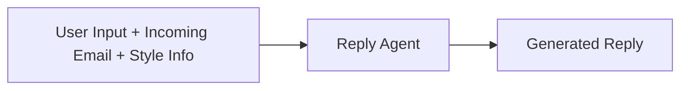

# 📬 Email Style Analyzer & Reply Generator

## 🧠 Overview  
This project analyzes a sender's email writing style and generates consistent, context-aware replies using GPT and the Enron Email Dataset. It integrates with [Semantic Kernel](https://github.com/microsoft/semantic-kernel) to orchestrate prompt flows and agent coordination.

---

## 🚀 Features & Modules

### ✅ 1. Style Analysis Agent (Completed)

```mermaid
flowchart LR
    A[Input Past Emails] --> B[Style Extractor]
    B --> C[Style Summary (JSON)]
```

* Parses historical emails from the sender.
* Outputs a JSON capturing writing traits such as:
  * Tone
  * Structure
  * Greeting and sign-off patterns
  * Language preferences

---

### ✉️ 2. Reply Generator (In Progress)



* Inputs:
  * Incoming email
  * Up to 5 recent email threads
  * Style summary (from Style Agent)
  * User instructions or intent
* Output: A reply email consistent with the sender’s writing style and context

---

### 🧠 3. Mail Context Profiler (Planned)

* Purpose: Improve accuracy of style analysis by understanding deeper user context  
* Approach: Let GPT scan the user’s email history to build a richer, implicit tone model  
* Use Case: Enhances style consistency even for ambiguous or short prompts

---

### ⏸️ 4. Project Extractor (On Hold)

```mermaid
flowchart LR
    A[Input Emails] --> B[Project Info Extractor]
    B --> C[Project Summary (JSON)]
```

* Extracts project-related details (temporarily deprioritized):
  * Project names, statuses, and timelines
  * Milestones
  * Involved members
  * Relevant keywords

---

## ✨ Highlights

* **Email Style Profiling**  
  Identify and summarize tone, formatting, and stylistic traits.

* **Context-Aware Reply Generation**  
  Use email history and user input to create smart, style-aligned replies.

* **Agent-Based Design**  
  Built to work with tools like Semantic Kernel for modular, scalable orchestration.

---

## 📁 Dataset

We use the [Enron Email Dataset](https://www.kaggle.com/datasets/wcukierski/enron-email-dataset/data), which contains real-world emails exchanged among Enron employees.

---

## 🧱 Tech Stack

* **Language Model**: OpenAI GPT
* **Agent Orchestration**: Semantic Kernel
* **Backend**: Python
* **Data Format**: JSON (for style and prompt summaries)
* **Dataset**: Enron Email Dataset (Kaggle)

start ： uvicorn app:app --reload